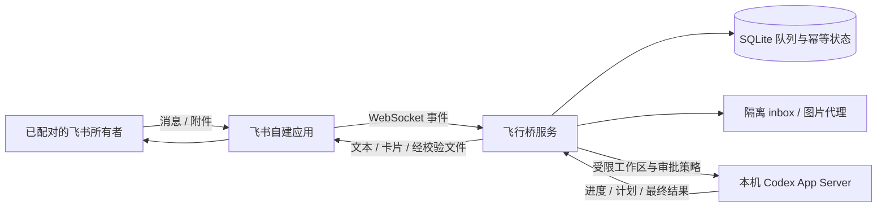

# 架构

## 核心组件

- `FeishuGateway`：飞书 REST、WebSocket、群组和文件传输。
- `BridgeDB`：消息接收、重试、幂等、绑定、审批和交付状态。
- `CodexAppServer`：与本机 Codex 的 JSONL 协议边界。
- `BridgeService`：所有者校验、每 thread 串行调度、恢复和进度投影。
- `ArtifactBroker`：附件隔离、图片代理、结果审批与上传校验。

## 可靠性原则

- 飞书事件先写入 SQLite，再向回调返回。
- 每个 Codex thread 使用独立 FIFO，避免同一项目并发覆盖。
- 非幂等 RPC 前记录状态；无法证明是否成功时停止自动重放并要求人工核对。
- outbox 以稳定 key 去重并持久重试；分段消息按 group/sequence 顺序发送。
- 重启只恢复能够证明安全的工作，状态不明确的任务保持锁定。
